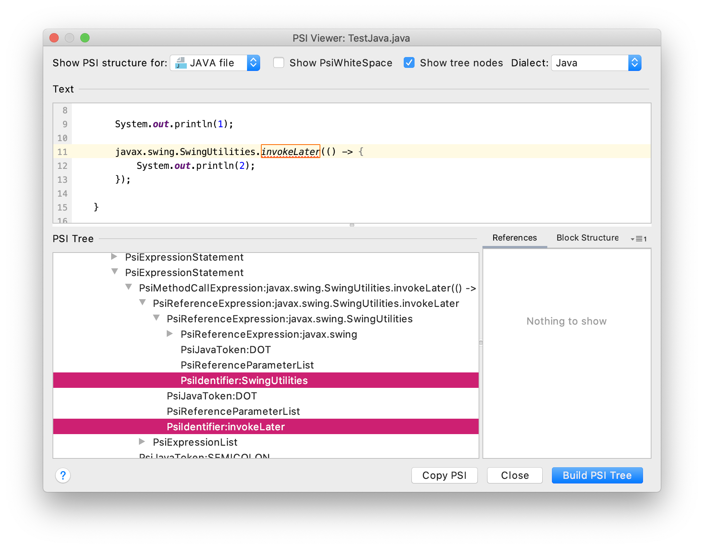

# Test problem

## Java inspection

A `JavaLocalInspector` looking for the following `PsiReferenceExpression` is setup :

1. `expression.firstChild` is a `PsiReferenceExpression` corresponding to `*.SwingUtilies`
1. `expression.lastChild` is a `PsiIdentifier` corresponding to `invokeLater`

## Kotlin inspection

A `AbstractUastNonRecursiveVisitor` looking for the following `UExpression` node is setup :

1. `sourcePsi` is a `REFERENCE_EXPRESSION` corresponding to `invokeLater`
1. the "parent" `sourcePsi?.parent?.parent?.firstChild?.lastChild` is a `REFERENCE_EXPRESSION` corresponding to `SwingUtilities`

