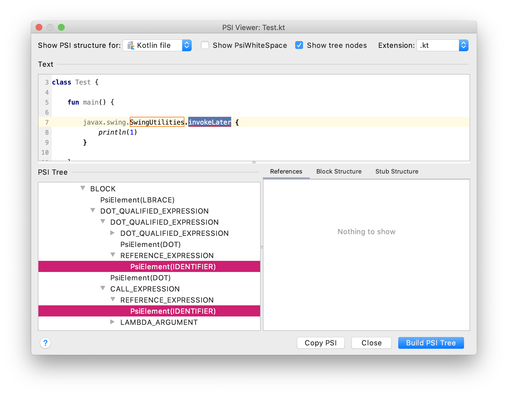

# Test problem

Write inspection to detect `pack.ages.Class.fun`

## Java inspection

1. `visitReferenceExpression` looks for a `PsiReferenceExpression` where the `lastChild` name is `fun`.
1. Then it checks whether `expression.resolve().stub.parentStub` corresponds to `pack.ages.Class`

## Kotlin inspection (obsolete)

A `AbstractUastNonRecursiveVisitor` looking for the following `UExpression` node is setup :

1. `sourcePsi` is a `REFERENCE_EXPRESSION` corresponding to `invokeLater`
1. the "parent" `sourcePsi?.parent?.parent?.firstChild?.lastChild` is a `REFERENCE_EXPRESSION` corresponding to `SwingUtilities`

